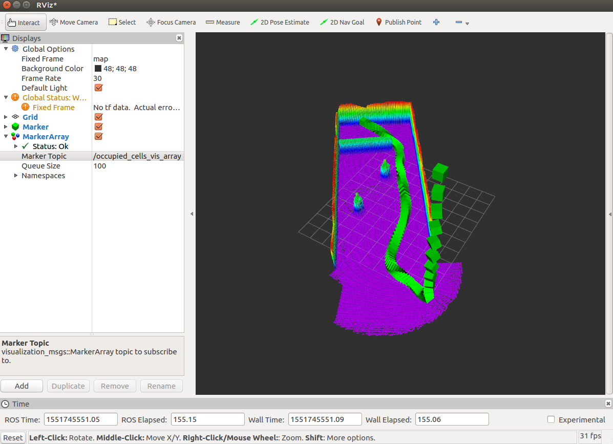

## path_planning
A global Planner for a fly/drive concept vehicle in 3D Octomap environment. The Octomap can be created by a Lidar/Structured Light camera and saved in a .bt/.ot file. Since it is extremely power inefficient to fly in comparison to drive we always want our vehicle to drive unless absolutly necessary.

## Results




## Comparison
As we can see the second image path is more efficient than the first image as it immediately goes to ground and drives the rest of its way to its goal position. 
  

## Dependencies

[1] FCL-0.5 (collision checking)\
[2] OMPL -1.2.1 (Motion Planning)\
[3] ROS Kinetic (Mainly sensor fusion and Rviz)\


## Run Instructions

```bash
git clone
source devel/setup.bash
roscore
rosrun rviz rviz
rosrun octomap_server octomap_server_node xyzz.bt
rosrun path_planning path_planning
```

## TODO
[1]Optimize the Planner using better statecost function and statesampler\

[2]Create a replanning node for online Plannning\
  
## License 

MIT

 
